ACESSAR O SISTEMA
=================
[(Video)](http://gpweb/manual/v_a1.html#rodape)

Para acessar o sistema GP-Web, instância em produção do Ministério do Planejamento, Orçamento e Gestão MP, navegar até o endereço, disponível na intranet do MP, http://gpweb/. A tela de autenticação no sistema é apresentada, conforme figura abaixo. Caso possua usuário ativo e cadastrado no sistema, preencher o campo login (1) com o usuário, o campo senha (2) com sua respectiva senha e clicar no botão entrar (3). Caso ainda não possua usuário cadastrado no sistema, clicar no link criar uma conta (4).

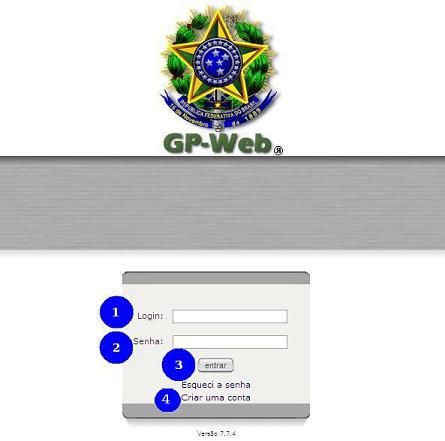 &nbsp;

Preencher o campo de login (5) com o login de rede, normalmente o mesmo utilizado no e-mail corporativo (parte que antecede @planejamento.gov.br. Preencher o campo de senha (6), repetindo-a no campo de confirmação (7). Escolher um pronome de tratamento e preencher o campo com primeiro e último nomes (8). Preencher o campo função (9) com o cargo ocupado. Preencher o campo nome completo (10). Preencher o campo e-mail principal (11) com seu e-mail corporativo. Escolher a unidade organizacional (12) de alocação. Caso a mesma não esteja presente dentre as opções, escolher qualquer uma e enviar e-mail para cproj.dst@listas.planejamento.gov.br (contendo o nome oficial da coordenação/coordenação-geral/departamento/secretaria e suas siglas) para que seja providenciada sua correta inclusão. Selecionar a unidade federativa no estado (13). Selecionar o município (14). Clicar em inscrever (15).

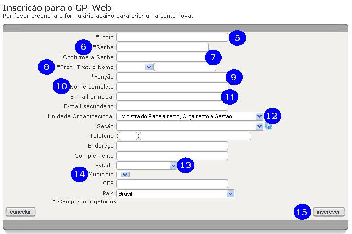 &nbsp;

Uma mensagem informando que o Administrador do Sistema avisado é exibida. Clicar em Ok (16). Assim que o Administrador do Sistema ativar o usuário, uma mensagem é enviada ao e-mail registrado no cadastro deste.

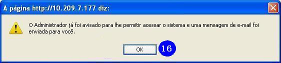 &nbsp;

ALTERAR A SENHA
===============
[(Video)](http://gpweb/manual/v_a2.html#rodape)

AUTENTICADO NO SISTEMA, clicar no botão meus dados (1)

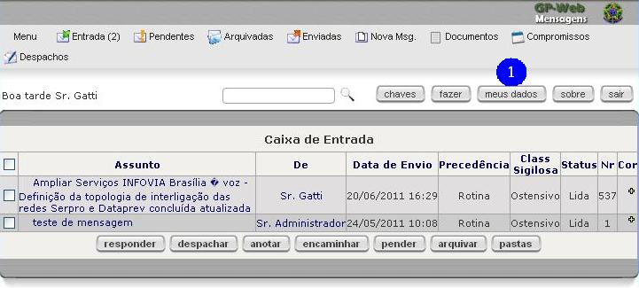 &nbsp;

Na tela de detalhes do usuário, clicar no botão mudar a senha.

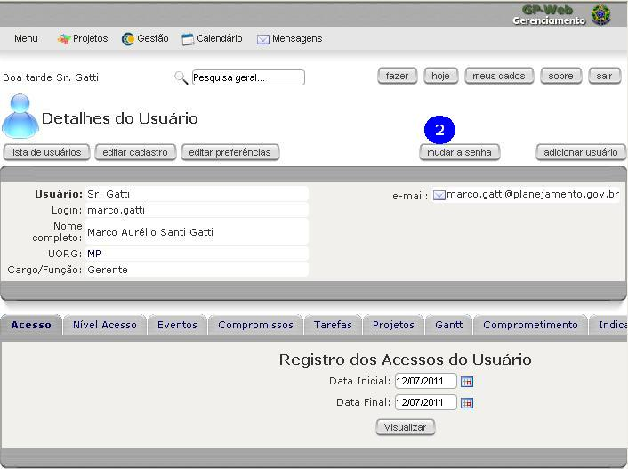 &nbsp;

Preencher o campo nova senha (3) com a nova senha. Repetir a mesma senha criada no campo repetir nova senha (4). Clicar no botão confirmar.

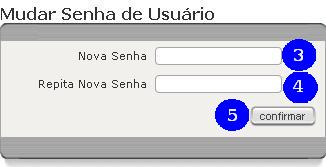 &nbsp;

A mensagem a sua senha foi alterada (6) é exibida, confirmando a alteração da senha.

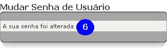 &nbsp;

SAIR DO SISTEMA
===============
[(Video)](http://gpweb/manual/v_a3.html#rodape)

[Autenticado no sistema](http://gpweb/manual/a1.html), clicar no botão sair (1).

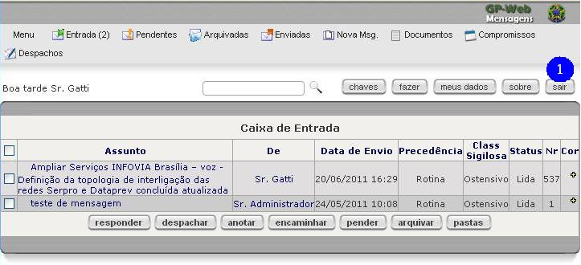 &nbsp;

A tela de autenticação no sistema é exibida (2).

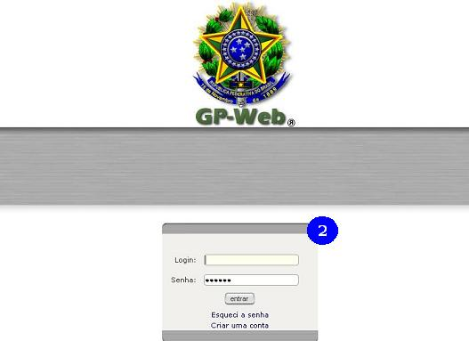 &nbsp;

NAVEGAÇÃO PELOS PROJETOS
========
[(Video)](http://gpweb/manual/v_p1.html#rodape)

Autenticado no sistema ([como autenticar-se](http://gpweb/manual/a1.html)) ir até a opção projetos (1) no menu do sistema.

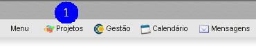 &nbsp;

Utilizar o controle UORG (2), de Unidades Organizacionais, para localizar a Secretaria, o Departamento, a Coordenação-Geral, a Coordenação, etc, responsável pelo projeto. Clicar no funil  (3) para localizar os projetos. Navegar pelas abas todos, ativo, indefinido, iniciação, planejamento, execução, encerramento, suspenso, encerrado e recebido (4) para uma segunda filtragem nos projetos localizados. Na lista dos projetos (5), são exibidas informações tais como a cor do projeto ( = Prioritário,  = Estratégico e = Departamental), percentual de realização, UORG do projeto, datas de início e término previstas, data provável (baseada na data de término da última tarefa a encerrar no projeto), responsável (gerente do projeto), TM (tarefas do projeto, com o número de tarefas entre parênteses que são de responsabilidade do usuário autenticado no sistema), custo e status da execução. Clicar em no nome do projeto caso deseje observar detalhes do mesmo. Clicar no responsável para observar detalhes do usuário que representa o gerente do projeto.

 &nbsp;

ENVIAR PROJETOS
=
[(Video)](http://gpweb/manual/v_p2.html#rodape)

Na tela de listas de projetos ([como chegar](http://gpweb/manual/p1.html)), preencher a caixa de checagem (1) do projeto a ser enviado. Clicar no botão enviar (2).

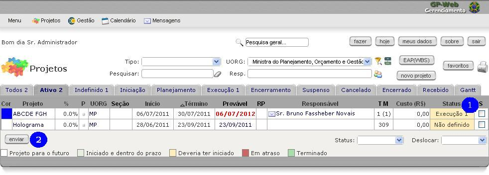 &nbsp;

Selecionar a unidade organizacional à esquerda (3). Clicar no botão incluir (4). A unidade de destino estará disponível entre as organizações destinatárias (5). Clicar no botão enviar(6).

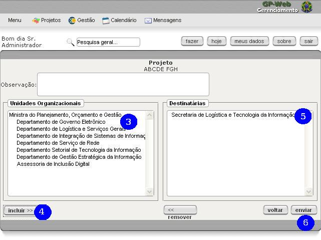 &nbsp;

A mensagem de projeto enviado (7) é exibida. O projeto estará disponível na outra unidade organizacional assim que for [recebido](http://gpweb/manual/p3.html).

 &nbsp;

RECEBER PROJETOS
=
[(Video)](http://gpweb/manual/v_p3.html#rodape)

Esta função é utilizada para receber projetos de outra unidade organizacional, previamente enviados - [como enviar](http://gpweb/manual/p2.html) -, de modo a serem observados pelos usuários alocados em outras unidades organizacionais. Na tela de lista de projetos - [como chegar](http://gpweb/manual/p1.html) - , clicar no botão receber (1). Note que no botão existe um número. Este número é o número de projetos pendentes aguardando aceitação ou rejeição.

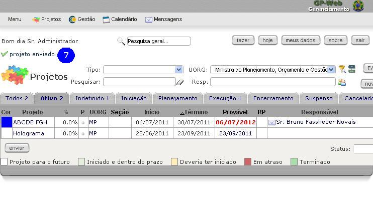 &nbsp;

Na lista dos projetos pendentes, preencher o campo de checagem (2) do projeto que deseja-se processar. Duas ações estão disponíveis: caso deseje recusar o recebimento, preencher o campo observação e clicar no botão recusar (3); caso deseje aceitá-lo, clicar no botão aceitar (4).

 &nbsp;

No caso de aceitação do projeto, a mensagem projeto recebido (5) é exibida. O projeto agora passa a estar presente dentro dos projetos da aba recebidos (6).

 &nbsp;

DETALHES DOS PROJETOS
=
Na tela de lista de projetos ([como chegar](http://gpweb/manual/p1.html)), clicar nos links dos projetos (1). Na tela de detalhes do projetos, várias informações referentes ao projeto são exibidas, tais como a [Unidade Organizacional (UORG)](http://gpweb/manual/glossario.html#uorg) de alocação do projeto, o seu nome abreviado, as suas datas de previsão de início e término, o seu final atualizado, baseado na previsão de término de sua tarefa mais tardia, seu gerente de projetos (3). São exibidas também informações sobre seu status, seu [nível de acesso](http://gpweb/manual/glossario.html#nivel_de_acesso), sua prioridade, o progresso em seu desenvolvimento, se está ativo, a quantidade de horas já trabalhadas nele, a quantidade de esforço previsto, etc (3). Na parte de baixo da tela, algumas abas são apresentadas contendo informações mais detalhadas do projeto. A primeira aba, tarefas (4), apresenta as tarefas do projeto, incluindo seu progresso, nome da tarefa, o responsável por sua execução, seus designados, a data de início e término previstos e a quantidade de dias para sua execução. Clicar na aba tarefas inativas (5).

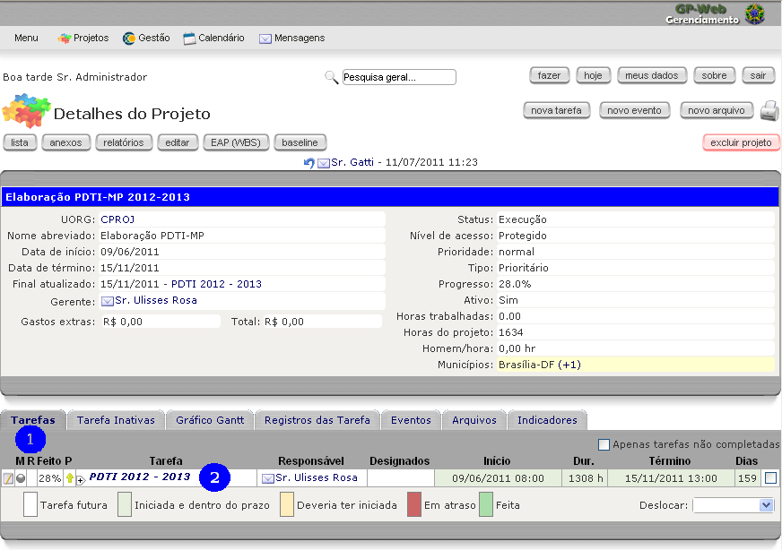 &nbsp;

São exibidas tarefas inativas (6). Clicar na aba gráfico gantt (7).

São exibidas as tarefas dispostas cronologicamente em gráfico (8). Os campos no topo da tela com datas de e até filtram o intervalo de datas que o gráfico exibe, após clicar no botão confirmar. Neste, as linhas pretas  mostram a duração tarefas agrupadas. Barras vazias  exibem tarefas ainda não concluídas. Barras cheias  exibem tarefas concluídas. Setas vermelhas  indicam depedencias entre tarefas. Losangos  exibem marcos do projeto. Clicar na aba registros das tarefas (9).

Nesta aba são exibidos todos os registros de ocorrências nas tarefas dos projetos (10). Nestas ocorrências podem ser identificados problemas (exibidos com destaque pela cor bordô) e soluções para as tarefas, e são necessárias para expremir o progresso das tarefas. Clicar na aba eventos (11).

São exibidos todos os eventos(12) relacionados ao projeto, tais como reuniões. Clicar na aba arquivos (13).

São exibidas pastas (caso existentes) que contém os arquivos anexados ao projeto (14). Clicar na aba indicadores (15).

São exibidos os indicadores referentes ao projeto (16), caso cadastrados. clicar no botãoanexos (17).

São exibidos artefatos do projeto, em forma documental, acessíveis navegando pelos links à esquerda (18). Os botões  e  contraem e expandem detalhes, respectivamente. Navegar até a tela anterior, de detalhes do projeto ([como chegar](http://gpweb/manual/p1.html)), e clicar no botão EAP (WBS).

São exibidas todas as tarefas do projeto. Os botões  e  contraem e expandem detalhes, respectivamente (19). Os botões expandir tudo (20) e contrair tudo (21) expandem e contraem todos os níveis de aninhamento, respectivamente.

DETALHES DAS TAREFAS
=

Na tela de detalhes de projeto (como chegar), na aba tarefas, é possível verificar as tarefas cadastradas para o projeto. Nesta tela já são exibidas informações gerais sobre as tarefas (1), tais como progresso (coluna feito), nome da tarefa (coluna tarefa), responsável, designados, datas de previsão para início e término da tarefa e duração estimada. clicar no nome da tarefa (2) para ver seus detalhes.
