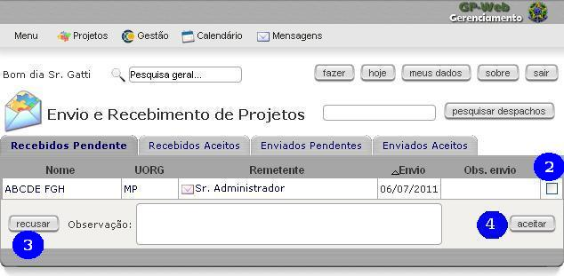

ACESSAR O SISTEMA
=================
[(Video)](http://gpweb/manual/v_a1.html#rodape)

Para acessar o sistema GP-Web, instância em produção do Ministério do Planejamento, Orçamento e Gestão MP, navegar até o endereço, disponível na intranet do MP, http://gpweb/. A tela de autenticação no sistema é apresentada, conforme figura abaixo. Caso possua usuário ativo e cadastrado no sistema, preencher o campo login (1) com o usuário, o campo senha (2) com sua respectiva senha e clicar no botão entrar (3). Caso ainda não possua usuário cadastrado no sistema, clicar no link criar uma conta (4).

 &nbsp;

Preencher o campo de login (5) com o login de rede, normalmente o mesmo utilizado no e-mail corporativo (parte que antecede @planejamento.gov.br. Preencher o campo de senha (6), repetindo-a no campo de confirmação (7). Escolher um pronome de tratamento e preencher o campo com primeiro e último nomes (8). Preencher o campo função (9) com o cargo ocupado. Preencher o campo nome completo (10). Preencher o campo e-mail principal (11) com seu e-mail corporativo. Escolher a unidade organizacional (12) de alocação. Caso a mesma não esteja presente dentre as opções, escolher qualquer uma e enviar e-mail para cproj.dst@listas.planejamento.gov.br (contendo o nome oficial da coordenação/coordenação-geral/departamento/secretaria e suas siglas) para que seja providenciada sua correta inclusão. Selecionar a unidade federativa no estado (13). Selecionar o município (14). Clicar em inscrever (15).

 &nbsp;

Uma mensagem informando que o [Administrador do Sistema](http://gpweb/manual/glossario.html#admin) avisado é exibida. Clicar em Ok (16). Assim que o [Administrador do Sistema](http://gpweb/manual/glossario.html#admin) ativar o usuário, uma mensagem é enviada ao e-mail registrado no cadastro deste.

 &nbsp;

ALTERAR A SENHA
===============
[(Video)](http://gpweb/manual/v_a2.html#rodape)

[Autenticado no sistema](http://gpweb/manual/a1.html), clicar no botão meus dados (1)

 &nbsp;

Na tela de detalhes do usuário, clicar no botão mudar a senha.

 &nbsp;

Preencher o campo nova senha (3) com a nova senha. Repetir a mesma senha criada no campo repetir nova senha (4). Clicar no botão confirmar.

 &nbsp;

A mensagem a sua senha foi alterada (6) é exibida, confirmando a alteração da senha.

 &nbsp;

SAIR DO SISTEMA
===============
[(Video)](http://gpweb/manual/v_a3.html#rodape)

[Autenticado no sistema](http://gpweb/manual/a1.html), clicar no botão sair (1).

 &nbsp;

A tela de autenticação no sistema é exibida (2).

 &nbsp;

NAVEGAÇÃO PELOS PROJETOS
========
[(Video)](http://gpweb/manual/v_p1.html#rodape)

Autenticado no sistema ([como autenticar-se](http://gpweb/manual/a1.html)) ir até a opção projetos (1) no menu do sistema.

 &nbsp;

Utilizar o controle UORG (2), de Unidades Organizacionais, para localizar a Secretaria, o Departamento, a Coordenação-Geral, a Coordenação, etc, responsável pelo projeto. Clicar no funil  (3) para localizar os projetos. Navegar pelas abas todos, ativo, indefinido, iniciação, planejamento, execução, encerramento, suspenso, encerrado e recebido (4) para uma segunda filtragem nos projetos localizados. Na lista dos projetos (5), são exibidas informações tais como a cor do projeto ( = Prioritário,  = Estratégico e = Departamental), percentual de realização, UORG do projeto, datas de início e término previstas, data provável (baseada na data de término da última tarefa a encerrar no projeto), responsável (gerente do projeto), TM (tarefas do projeto, com o número de tarefas entre parênteses que são de responsabilidade do usuário autenticado no sistema), custo e status da execução. Clicar em no nome do projeto caso deseje observar detalhes do mesmo. Clicar no responsável para observar detalhes do usuário que representa o gerente do projeto.

 &nbsp;

ENVIAR PROJETOS
=
[(Video)](http://gpweb/manual/v_p2.html#rodape)

Na tela de listas de projetos ([como chegar](http://gpweb/manual/p1.html)), preencher a caixa de checagem (1) do projeto a ser enviado. Clicar no botão enviar (2).

 &nbsp;

Selecionar a unidade organizacional à esquerda (3). Clicar no botão incluir (4). A unidade de destino estará disponível entre as organizações destinatárias (5). Clicar no botão enviar(6).

 &nbsp;

A mensagem de projeto enviado (7) é exibida. O projeto estará disponível na outra unidade organizacional assim que for [recebido](http://gpweb/manual/p3.html).

 &nbsp;

RECEBER PROJETOS
=
[(Video)](http://gpweb/manual/v_p3.html#rodape)

Esta função é utilizada para receber projetos de outra unidade organizacional, previamente enviados - [como enviar](http://gpweb/manual/p2.html) -, de modo a serem observados pelos usuários alocados em outras unidades organizacionais. Na tela de lista de projetos - [como chegar](http://gpweb/manual/p1.html) - , clicar no botão receber (1). Note que no botão existe um número. Este número é o número de projetos pendentes aguardando aceitação ou rejeição.

 &nbsp;

Na lista dos projetos pendentes, preencher o campo de checagem (2) do projeto que deseja-se processar. Duas ações estão disponíveis: caso deseje recusar o recebimento, preencher o campo observação e clicar no botão recusar (3); caso deseje aceitá-lo, clicar no botão aceitar (4).

 &nbsp;

No caso de aceitação do projeto, a mensagem projeto recebido (5) é exibida. O projeto agora passa a estar presente dentro dos projetos da aba recebidos (6).

 &nbsp;

DETALHES DOS PROJETOS
=
Na tela de lista de projetos ([como chegar](http://gpweb/manual/p1.html)), clicar nos links dos projetos (1). Na tela de detalhes do projetos, várias informações referentes ao projeto são exibidas, tais como a [Unidade Organizacional (UORG)](http://gpweb/manual/glossario.html#uorg) de alocação do projeto, o seu nome abreviado, as suas datas de previsão de início e término, o seu final atualizado, baseado na previsão de término de sua tarefa mais tardia, seu gerente de projetos (3). São exibidas também informações sobre seu status, seu [nível de acesso](http://gpweb/manual/glossario.html#nivel_de_acesso), sua prioridade, o progresso em seu desenvolvimento, se está ativo, a quantidade de horas já trabalhadas nele, a quantidade de esforço previsto, etc (3). Na parte de baixo da tela, algumas abas são apresentadas contendo informações mais detalhadas do projeto. A primeira aba, tarefas (4), apresenta as tarefas do projeto, incluindo seu progresso, nome da tarefa, o responsável por sua execução, seus designados, a data de início e término previstos e a quantidade de dias para sua execução. Clicar na aba tarefas inativas (5).

 &nbsp;

São exibidas tarefas inativas (6). Clicar na aba gráfico gantt (7).

São exibidas as tarefas dispostas cronologicamente em gráfico (8). Os campos no topo da tela com datas de e até filtram o intervalo de datas que o gráfico exibe, após clicar no botão confirmar. Neste, as linhas pretas  mostram a duração tarefas agrupadas. Barras vazias  exibem tarefas ainda não concluídas. Barras cheias  exibem tarefas concluídas. Setas vermelhas  indicam depedencias entre tarefas. Losangos  exibem marcos do projeto. Clicar na aba registros das tarefas (9).

Nesta aba são exibidos todos os registros de ocorrências nas tarefas dos projetos (10). Nestas ocorrências podem ser identificados problemas (exibidos com destaque pela cor bordô) e soluções para as tarefas, e são necessárias para expremir o progresso das tarefas. Clicar na aba eventos (11).

São exibidos todos os eventos(12) relacionados ao projeto, tais como reuniões. Clicar na aba arquivos (13).

São exibidas pastas (caso existentes) que contém os arquivos anexados ao projeto (14). Clicar na aba indicadores (15).

São exibidos os indicadores referentes ao projeto (16), caso cadastrados. clicar no botão anexos (17).

São exibidos artefatos do projeto, em forma documental, acessíveis navegando pelos links à esquerda (18). Os botões  e  contraem e expandem detalhes, respectivamente. Navegar até a tela anterior, de detalhes do projeto ([como chegar](http://gpweb/manual/p1.html)), e clicar no botão EAP (WBS).

São exibidas todas as tarefas do projeto. Os botões  e  contraem e expandem detalhes, respectivamente (19). Os botões expandir tudo (20) e contrair tudo (21) expandem e contraem todos os níveis de aninhamento, respectivamente.

DETALHES DAS TAREFAS
=

Na tela de detalhes de projeto [(como chegar)](http://gpweb/manual/p4.html), na aba tarefas, é possível verificar as tarefas cadastradas para o projeto. Nesta tela já são exibidas informações gerais sobre as tarefas (1), tais como progresso (coluna feito), nome da tarefa (coluna tarefa), responsável, designados, datas de previsão para início e término da tarefa e duração estimada. clicar no nome da tarefa (2) para ver seus detalhes.

 &nbsp;

Na tela de detalhes da tarefa, várias informações (3) são exibidas, tais como nome da tarefa, UORG, responsável, prioridade, se é [marco do projeto](http://gpweb/manual/glossario.html#marco), o progresso de sua execução, tempo já trabalhado nesta tarefa, seu [nível de acesso](http://gpweb/manual/glossario.html#nivel_de_acesso), datas de previsão de início e término da tarefa, sua previsão de conclusão inicial, sua previsão de duração, dependência de outras tarefas e tarefas dela dependente. Na parte inferior da tela, na aba [tarefas subordinadas](http://gpweb/manual/glossario.html#tarefa_subordinada) (4), são exibidas as tarefas à esta subordinadas. Clicar na aba eventos (5).

 &nbsp;

Na aba de eventos são exibidos os eventos (6) ligados à esta tarefa. clicar na aba arquivos(7).

 &nbsp;

Na aba de arquivos são exibidas as pastas de arquivos e seus arquivos (8). Clicar na aba gráfico gantt (9).

 &nbsp;

São exibidas as tarefas dispostas cronologicamente em gráfico (10). Os campos no topo da tela com datas de e até (11) filtram o intervalo de datas que o gráfico exibe, após clicar no botão confirmar (12). Neste, as linhas pretas  mostram a duração tarefas agrupadas. Barras vazias  exibem tarefas ainda não concluídas. Barras cheias  exibem tarefas concluídas. Setas vermelhas  indicam dependências entre tarefas. Losangos  exibem marcos do projeto. Clicar na aba indicadores (13).

 &nbsp;

São exibidos os indicadores relativos à tarefa (14).

 &nbsp;

DETALHES DOS REGISTROS DAS TAREFAS
=

Os registros das tarefas são responsáveis por registrar atividades ocorridas na execução das atividades dos projetos, indicando, entre outros,  progresso, horas trabalhadas e problemas ocorridos. Na tela de detalhes do projeto ([como chegar](http://gpweb/manual/p4.html)), clicar na aba registros das tarefas(1).

 &nbsp;

No conteúdo da aba de registros das tarefas é possível ver todos os registros de todas as tarefas do projeto(2). São exibidas as datas dos registros, as tarefas às quais se relacionam, os tipos de eventos que geraram os registros (como reuniões, por exemplo), os títulos dos registros (que normalmente repete os nomes das tarefas), as URLs de referencias, os responsávis pelos registros, os números de horas trabalhadas desde o último registro ocorrido (ou inicio de execução da tarefa, caso não houverem registros anteriores para as mesmas tarefas), os comentários, os números de despesas, os custos realizados e os botões de exclusão dos registros. Clicar no nome da tarefa (3).

 &nbsp;

Na tela de detalhes das tarefas, os registros são exibidos dentro da aba registros da tarefa(4).

 &nbsp;

ADICIONAR PROJETOS
=

Na tela da lista de projetos [(como chegar)](http://gpweb/manual/p1.html), clicar no botão novo projeto (1).

 &nbsp;

Preencher as informações do projeto: nome do projeto (2), sigla do projeto (3), [Unidade Organizacional (UORG)](http://gpweb/manual/glossario.html#uorg) de alocação do projeto (4), gerente do projeto (5), [nível de acesso](http://gpweb/manual/glossario.html#uorg) como protegido (6), datas de início e término estimados (7), a cor do projeto (8), com (#0000FF) para projetos prioritários,  (#00AA00) para projetos estratégicos e (#000000) para projetos departamentais, tipo do projeto(9), status do projeto (10), se está ativo (11), mantendo o campo  preenchido, se o gerente e supervisor (12) receberão e-mails de notificação. Caso desejar, preencher demais informações. Clicar no botão confirmar (13).

 &nbsp;

A mensagem de confirmação da inserção do projeto é exibida (14).

 &nbsp;

ADICIONAR TAREFAS  
=

Na tela de detalhes do projeto [(como chegar)](http://gpweb/manual/p4.html), clicar no botão nova tarefa (1).

 &nbsp;

Preencher o nome da tarefa (2). Selecionar se a tarefa está ou não ativa (3). Manter, no cadastro das tarefas, o progresso em 0 (zero) porcento (4). Se for marco, preencher o campo correspondente (5). Selecionar o responsável pela tarefa (6). Preencher o campo notificar por e-mail (7) para que o responsável tome ciência via mensagem eletrônica. Selecionar o [nível de acesso](http://gpweb/manual/glossario.html#nivel_de_acesso) (8) como protegido. Clicar na aba datas (9).

 &nbsp;

Selecionar a data de início (10). Preencher o campo de data de término ou de duração esperada. Caso tenha preenchido a data de término, clicar no botão duração (12). Caso tenha preenchido a duração esperada, clicar no botão data de término (12). Clicar na aba dependências (13).

 &nbsp;

Preencher as dependências da tarefa (14) com as tarefas que esta tarefa depender, dentre as disponíveis no projeto (15), selecionando o tipo de dependência (16) e adicionando com o botão  Botão adicionar (17). Caso deseje remover a dependência, selecioná-la (14) e clicar no botão Botão remover (18). Clicar na aba designados (19).

 &nbsp;

Escolher o(as) designado(as) para a tarefa (20), dentre os disponíveis (21). Preencher o controle notificar por e-mail (22) para que os designados sejam avisados via mensagem eletrônica de suas designações, incluindo, caso desejado, uma mensagem personalizada (23). Clicar no botão confirmar (24).

 &nbsp;

A mensagem de confirmação, da adição da tarefa, é exibida (25).

 &nbsp;

ADICIONAR REGISTROS ÀS TAREFAS  
=

Na tela de detalhes da tarefa [(como chegar)](http://gpweb/manual/p5.html), clicar no botão novo registro (1) ou na aba registrar (2).

 &nbsp;

Preencher a data (3) com a data de registro da informação. Definir a porcentagem do progresso de execução em que a tarefa se encontrava no momento do registro (4). Preencher com o número de horas trabalhadas (5) desde o último registro da tarefa ou, desde o início da tarefa, caso seja seu primiero registro. Alterar o valor de data de término (6) caso a tarefa esteja sendo completada, com a data do registro. Escolher protegido como [nível de acesso (7)](http://gpweb/manual/glossario.html#nivel_de_acesso). Caso esteja reportando um problema, manter preenchido o campo problema (8). Selecionar a referência (9) que mais se enquadra. Preencher com uma descrição para o registro (10, reportando o ocorrido. Selecionar quais tipos de usuários serão notificados (11). Clicar em confirmar (12).

 &nbsp;

A mensagem de confirmação, da inserção do registro na tarefa, é exibida (13).

 &nbsp;

EDITAR PROJETOS  
=

Na tela de detalhes do projeto [(como chegar)](http://gpweb/manual/p4.html), clicar no botão editar (1).

 &nbsp;

Alterar todas as informações do projeto, conforme necessário. Clicar no botão confirmar (2).

 &nbsp;

A mensagem de confirmação, da atualização do projeto, é exibida (3).

 &nbsp;

EDITAR TAREFAS  
=

Na tela de detalhes da tarefa ([como chegar](http://gpweb/manual/p5.html)), clicar no botão editar (1).

 &nbsp;

Alterar todas as informações necessárias relacionadas à tarefa. Clicar no botão confirmar (2).

 &nbsp;

A mensagem de confirmação de atualização da tarefa é exibida (3).

 &nbsp;

EDITAR REGISTROS DAS TAREFAS  
=

Na tela de detalhes da tarefa [(como chegar)](http://gpweb/manual/p5.html), na aba de registros da tarefa, clicar no botão  (1), da linha respectiva do registro da tarefa que deseja alterar.

 &nbsp;

Alterar as informações dos campos conforme desejado. Clicar no botão confirmar (2).

 &nbsp;

A mensagem de confirmação da atualização do registro da tarefa é exibida (3).

 &nbsp;

EXCLUIR PROJETOS  
=

Na tela de detalhes do projeto [(como chegar)](http://gpweb/manual/p4.html) clicar no botão excluir projeto (1).

 &nbsp;

Na tela de confirmação de exclusão de projeto, clicar no botão ok (2).

 &nbsp;

A mensagem de confirmação projeto excluído é exibida (3).

 &nbsp;

EXCLUIR TAREFAS  
=

Na tela de detalhes da tarefa [(como chegar)](http://gpweb/manual/p5.html) clicar no botão excluir tarefa (1).

 &nbsp;

Na tela de confirmação de exclusão de tarefa, clicar no botão ok (2).

 &nbsp;

A mensagem de confirmação tarefa excluída é exibida (3).

 &nbsp;

EXCLUIR REGISTROS DE TAREFAS
=

Na tela de detalhes da tarefa [(como chegar)](http://gpweb/manual/p5.html), dentro da aba de registros da tarefa (1), clicar no botão Detalhe do botão excluir registro (2) da linha de registro que se deseja excluir.

 &nbsp;

A tela de confirmação de exclusão do registro é exibida. Clicar no botão ok (3).

 &nbsp;

A mensagem de confirmação de exclusão do registro é exibida (4).

 &nbsp;
